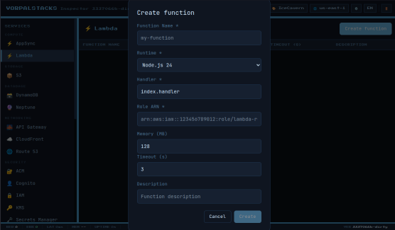

# Vorpalstacks

[日本語](README.ja.md) | [中文](README.zh.md)

> **Warning: This is a beta release.** Vorpalstacks is under active development. While all supported AWS services (list in [docs/services.md](docs/services.md)) are implemented, with 3,273 passing SDK tests, 50 cross-service integration tests, and 17 WebSocket tests (3,340 total, plus 631 Python, 2028 TypeScript, 2019 C#), not all edge cases and AWS behaviours are fully covered. Expect breaking changes. Bug reports and contributions are welcome.

A lightweight edge and on-premise cloud platform providing AWS-compatible services.

## Overview

Vorpalstacks enables running AWS-compatible services in environments where full AWS connectivity is not available:

- Edge computing scenarios
- On-premise deployments
- Development and testing environments
- Air-gapped networks



## Features

> **What this is**: A real implementation of AWS-compatible APIs, not a mock framework. Each service stores data in PebbleDB and supports multi-region isolation.

> **What this is not**: A fully faithful reproduction of every AWS behaviour. Some edge cases, undocumented behaviours, and advanced features may differ from AWS. See [docs/services.md](docs/services.md) for the current scope of each service.

- **AWS API Compatible**: Works with existing AWS SDKs and CLI
- **Broad AWS Service Coverage**: S3, SQS, SNS, Lambda, DynamoDB, API Gateway, AppSync, Step Functions, WAFv2, Kinesis, KMS, Neptune, Neptune Graph, IoT Core, and more — full list in [docs/services.md](docs/services.md)
- **IAM Authorization**: Full IAM policy evaluation with user/group/role-based access control
- **DynamoDB PartiQL**: SQL-like queries with WHERE functions (attribute_exists, begins_with, contains, size)
- **S3 SelectObjectContent**: SQL queries on CSV/JSON objects with event streaming
- **Multi-Region Support**: Region-isolated storage with dedicated PebbleDB per region
- **Global Services**: IAM, Route53, CloudFront, STS with shared global storage
- **gRPC-Web Admin API**: Connect-RPC admin interface on separate port for all services
- **Admin Console**: Web-based GUI for browsing resources across all services at `/webconsole/`
- **Lightweight**: Single binary, minimal dependencies
- **Persistent Storage**: Pebble-based key-value store
- **Docker Integration**: Lambda functions run in containers
- **Service Integration**: Event-driven communication between services with 50 cross-service integration tests
- **TLS Support**: Optional HTTPS with auto-generated or custom certificates
- **LocalStack Comparison**: See [docs/localstack_vs_vorpalstacks_report.md](docs/localstack_vs_vorpalstacks_report.md) for a technical comparison with LocalStack

## Implemented Services

| Service | Coverage | Notes |
|---------|----------|-------|
| ACM | Broad | No ACME protocol (19 ops) |
| API Gateway | Broad | No client certificates, documentation, or SDK generation |
| AppSync | Full | 74 control-plane operations, GraphQL execution, WebSocket pub/sub |
| Athena | Broad | No capacity reservations or notebook sessions |
| CloudFront | Selective | No actual edge traffic distribution |
| CloudTrail | Broad | No event data stores or SQL queries |
| CloudWatch Logs | Selective | No Logs Insights queries or export |
| CloudWatch Metrics | Broad | No metric streams or anomaly detection |
| Cognito IDP | Selective | No external IdP, no hosted UI |
| Cognito Identity | Selective | Basic identity pool support |
| DynamoDB | Broad | ION import/export not supported |
| EventBridge | Broad | No global endpoints or partner event sources |
| IAM | Broad | No custom-policy simulator (SimulatePrincipalPolicy and ListPoliciesGrantingServiceAccess implemented) or organisations integration. GetHumanReadableSummary excluded (external LLM dependence) |
| IoT Core | Broad | 272 operations incl. things, certificates, policies, rules engine (16 action types), jobs, shadows, device management. No firmware provisioning execution |
| Kinesis | Full | |
| KMS | Full | |
| Lambda | Broad | No durable functions or code signing |
| Neptune | Broad | Property graph, openCypher/Gremlin (HTTP + WebSocket), bulk loader. No SPARQL/RDF |
| Neptune Graph | Full | 34 control-plane operations, openCypher, vector search |
| Route53 | Selective | DNS record management only |
| S3 | Broad | No analytics, inventory, or S3 Express |
| Scheduler | Full | |
| Secrets Manager | Full | |
| SESv2 | Broad | No deliverability testing, dedicated IP address management, import/export jobs, multi-region endpoints, tenant management, custom verification email templates, reputation management, or account pricing plans |
| SNS | Broad | SMS sending not supported |
| SQS | Full | |
| SSM | Selective | Parameter Store only |
| STS | Full | |
| Step Functions | Full | |
| Timestream | Full | |
| WAFv2 | Broad | |

See [docs/services.md](docs/services.md) for detailed coverage tiers and service integration patterns.

## Quick Start

### Build

```bash
make build
```

This builds the web console frontend (`npm run build`) and then compiles the Go binary with the frontend embedded via `embed.FS`.

To build manually without Make:

```bash
cd webconsole && npm install && npm run build && cd ..
go build -o vorpalstacks .
```

### Run (Development Mode)

```bash
SIGNATURE_VERIFICATION_ENABLED=false DATA_PATH=./data ./vorpalstacks
```

The admin console is available at `http://localhost:50090/webconsole/` (port 50090 is the gRPC-Web admin port). AWS API endpoints are on port 50080.

### Run with Docker (for Lambda)

Docker must be installed and running. Lambda functions execute in Docker containers.

```bash
SIGNATURE_VERIFICATION_ENABLED=false DATA_PATH=./data DOCKER_HOST=unix:///var/run/docker.sock ./vorpalstacks
```

### Use with AWS CLI

```bash
export AWS_ENDPOINT_URL=http://localhost:50080

aws --endpoint-url=http://localhost:50080 --region us-east-1 --no-sign-request sns list-topics
aws --endpoint-url=http://localhost:50080 --region us-east-1 --no-sign-request sqs list-queues
aws --endpoint-url=http://localhost:50080 --region us-east-1 --no-sign-request lambda list-functions
```

## Testing

### Unit Tests

```bash
make test
```

### SDK Tests (AWS Go SDK v2)

```bash
# Start server
ALL_SERVICES_ENABLED=true SIGNATURE_VERIFICATION_ENABLED=false DATA_PATH=./data TEST_MODE=true tmp/vorpalstacks > tmp/server.log 2>&1 &

# Build and run tests
cd sdk-tests
go build -o sdk-tests-all .
ALL_SERVICES_ENABLED=true ./sdk-tests-all -service all -v
```

### CLI Integration Tests

```bash
cd scripts/services && bash test_sqs.sh
cd scripts/services && bash test_dynamodb.sh
cd scripts/services && bash test_s3.sh
cd scripts/services && bash test_iam.sh
```

## Configuration

### Environment Variables

| Variable | Default | Description |
|----------|---------|-------------|
| `PORT` | `50080` | HTTP server port |
| `DATA_PATH` | `./data` | Path for persistent data storage |
| `AWS_REGION` | `us-east-1` | Default region |
| `AWS_ACCOUNT_ID` | `000000000000` | AWS account ID |
| `SIGNATURE_VERIFICATION_ENABLED` | `true` | Enable AWS Signature V4 verification |
| `GRPC_WEB_PORT` | `50090` | gRPC-Web admin server port (also serves web console) |
| `TLS_ENABLED` | `false` | Enable TLS |
| `TLS_PORT` | `50443` | HTTPS server port |
| `AUTHORIZATION_ENABLED` | `false` | Enable IAM policy evaluation |
| `BIND_MODE` | `all` | Bind mode: `all` (0.0.0.0), `localhost`, or `interface` |
| `DOCKER_HOST` | `unix:///var/run/docker.sock` | Docker daemon socket for Lambda |

See [Configuration](docs/configuration.md) for the complete list.

### Example: Production Configuration

```bash
export AWS_ACCESS_KEY_ID=your-key-id
export AWS_SECRET_ACCESS_KEY=your-secret-key
export SIGNATURE_VERIFICATION_ENABLED=true
export AUTHORIZATION_ENABLED=true
export DATA_PATH=/var/lib/vorpalstacks
./vorpalstacks
```

## Data Storage Structure

```
DATA_PATH/
├── us-east-1/               # Region-specific storage
│   ├── pebble/              # PebbleDB for us-east-1
│   ├── code/                # Lambda function code
│   └── logs/                # CloudWatch Logs chunks
├── global/                  # Global services (IAM, Route53, CloudFront, STS)
│   └── pebble/
└── uploads/                 # S3 multipart uploads (temporary)
```

Each region has isolated storage including PebbleDB, Lambda code, and logs. Global services share dedicated storage.

## Docker Requirements

For Lambda functionality:

1. Docker must be installed and running
2. Lambda runtime images will be pulled automatically
3. Docker socket must be accessible at `DOCKER_HOST` (default: `unix:///var/run/docker.sock`)

## Documentation

- [Architecture](docs/architecture.md) - System architecture overview
- [Services](docs/services.md) - Implemented AWS services
- [Configuration](docs/configuration.md) - Environment variables and settings

## Known Limitations

- Not all AWS operations are implemented for every service — see [docs/services.md](docs/services.md) for details
- Some edge cases and undocumented AWS behaviours may differ
- No cross-account access control (single-account mode)
- CloudFront distributions do not serve actual edge traffic
- Cognito hosted UI domains are not supported (requires CloudFront edge)
- SQS FIFO queues have limited support
- DynamoDB ION import/export format is accepted in validation but not implemented at runtime

## Roadmap

- **Short-term**: Bug fixes, refactoring, and stability improvements
- **Terraform**: 28 services have passed basic conformance testing — see [vorpalstacks-conformance-tests](https://github.com/tagumasa/vorpalstacks-conformance-tests) for details and how to run

See [CHANGELOG.md](CHANGELOG.md) for release history.

## Requirements

- Go 1.25+
- Node.js 22+ (LTS, for web console build)
- Docker (for Lambda functionality)

## Performance

Vorpalstacks implements all supported services as native Go binaries backed by PebbleDB, avoiding the overhead of interpreted languages or external process dependencies.

This architecture enables sub-millisecond latencies for core operations, making it practical to run extensive API tests (3,273 SDK + 50 integration + 17 WebSocket Go tests, 631 Python, 2028 TypeScript, 2019 C# tests) directly within CI/CD pipelines without containerization overhead.

### Benchmark Results (Reference)

Platform: AMD Ryzen 7 5700U (16 cores), Linux, Go 1.25.11, Pebble v2.1.4

> **Note**: These figures are environment-dependent. Direct comparison with other systems is not meaningful without identical hardware, configuration, and workload.

| Service | Operation | Avg Latency | ops/sec |
|---------|-----------|-------------|---------|
| DynamoDB | GetItem | 0.87ms | ~1,150 |
| S3 | GetObject | 0.96ms | ~1,040 |
| SQS | SendMessage | 0.82ms | ~1,220 |

## License

This project is licensed under the [Functional Source License, Version 1.1, MIT Future License (FSL-1.1-MIT)](LICENSE).

> **Note**: The root licence will change to MIT after the project reaches production stability.

The `pkg/` directory contains code licensed under Apache License 2.0 — see `pkg/sqlparser/LICENSE.md` and `pkg/vsjwt/LICENSE` for details.
